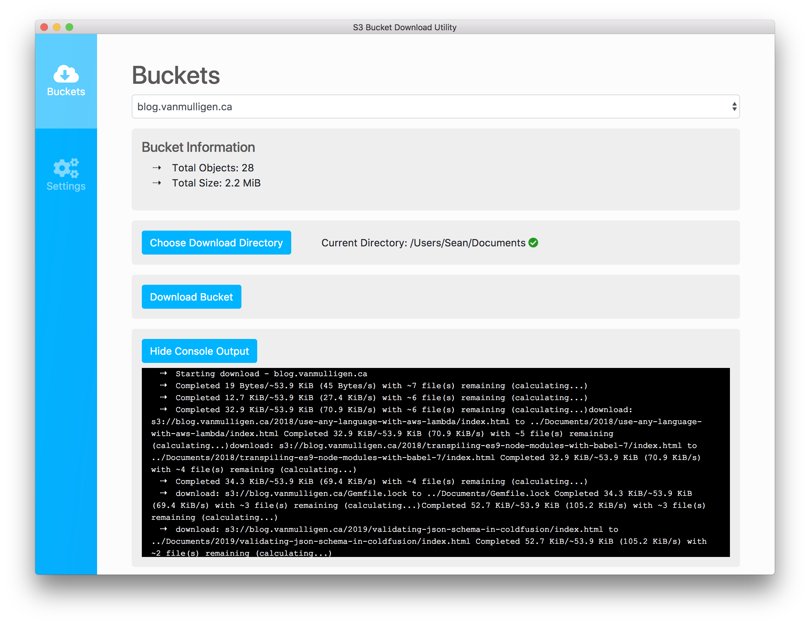

# S3 Sync Tool

[](https://app.codacy.com/app/sean_13/s3-sync-tool?utm_source=github.com&utm_medium=referral&utm_content=seanvm/s3-sync-tool&utm_campaign=badger)

This is an Electron/ReactJS desktop app that provides a UI for easily downloading S3 buckets. It primarily utilizes the AWS CLI for its core functionality.

This is a WIP, and as such is very limited in functionality, and may contain bugs. Do not use this to sync production s3 buckets.

<p align="center">
  
</p>

## Requirements
- You must have the [AWS CLI](https://aws.amazon.com/cli/) installed and configured.
- You must have at least one Amazon s3 bucket created.

## Setup

1. Install npm dependencies:
```
npm install
```

2. To run the app locally in development mode:
```
npm run dev
```

## Packaging The App

The build and package process has only been tested on macOS. However, with slight configuration tweaks the build process should work on Windows and Linux as well.

1. A single command runs the build and package process:
```
npm run package
```
This will output the packaged application to your dist folder. 

## Download Latest Release

You can download a copy of the latest version of this app (for macOS) to play around with on the [releases](https://github.com/seanvm/s3-sync-tool/releases) page of this repo.

## Future Plans

- Add the ability to configure AWS credentials directly through the app, and switch users/roles.
- Add file browser for s3.
- Allow for files to be uploaded to s3.
